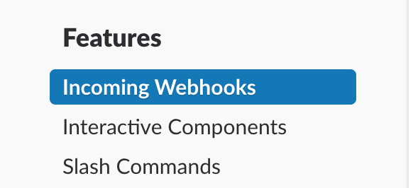
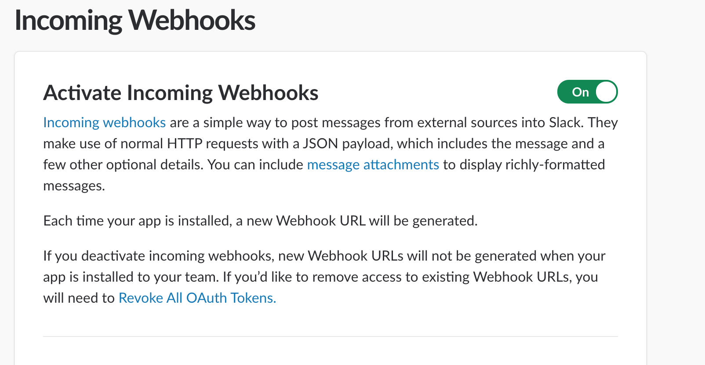
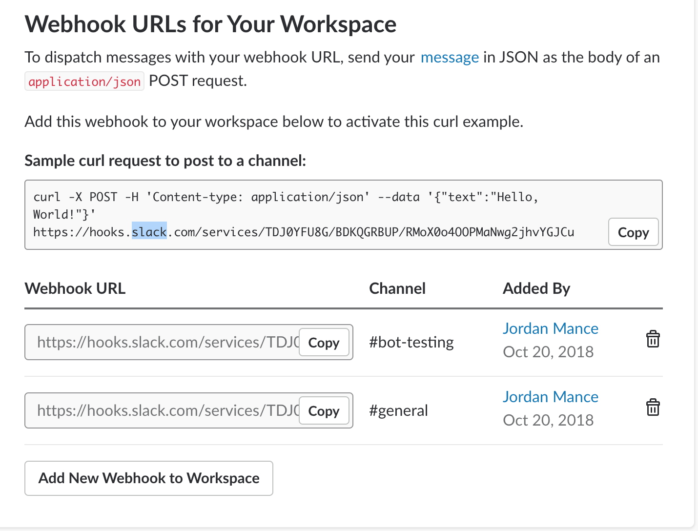
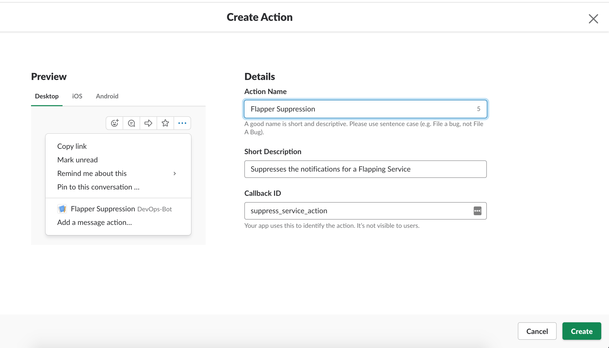
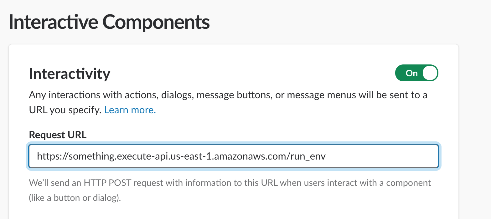

The Flapping Container Detector requires integration with a Slack Application. If you don't already have one, 
check out the [Slack App Docs!](https://api.slack.com/slack-apps)

Once you have created your Slack Application, you will need to configure 2 main features: Webhooks & Slack Actions.

Webhooks enable your Slack app to post to various channels in your Slack workspace. Slack Actions allow users in your Slack
workspace to take action on posted Flapping Container Detector messages.

### Step 1: Setting up Webhooks

- Once in your Slack app, select the "Incoming Webhooks" menu on the left to open the Incoming Webhooks configuration.

- Active Incoming webhooks by toggling the slider to "On" in the top right hand corner.

- Configure your default webhook. All Flapping Container detector notifications will go to the default webhook's channel if not otherwise redirected.

To configure the default webhook:

1) Select "Add New Webhook to Workspace"
2) Select the channel you want all notifications to be pushed to (you may override notifications to other channels on a service by service basis later)
3) Click Authorize
4) Under the webhook list, find your new webhook and *copy the webhook url*
5) In your config.tfvars (found in the root directory of your project) set the value of the `default_slack_channel_webhook` property to your copied webhook url.
6) Also in config.tfvars, set the `default_slack_channel` to the channel name associated with the default webhook. DO NOT INCLUDE THE #

Repeat for non-default channels. For every new channel / webhook you add, you can configure service routing to them on a serivce-by-service basis.
To do so, run the "scripts/add_webhook.sh" bash script to add a webhook, and "scripts/redirect_service.sh" bash script to make all notifications
for service `foo` to be redirected to a new channel.

**Be sure to check the comments at the top of your add_webhook.sh bash script, you will need to slightly adjust your ~/.aws/config file for it to work.**

### Step 2: Setting up your Slack Callback Action

- Select the "Interactive Components" from the left Nav bar in your Slack Application
- Toggle Interactivity on by adjusting the slider.
- Under "Actions" select "Create new Action"

- Input an Action Name. Take this _exact_ name and set the value of config.tfvars / `slack_suppress_flapper_action_name` to your inputted action name.
- Input a callback_id. Take this _exact_ callback id and set the value of config.tfvars / `slack_suppress_flapper_callback_id` to your inputted callback_id.

### Step 3: Deploy your App. 
- Follow the guide in the [Deployment Guide](deployment_guide.md "Deployment Guide") to deploy your flapping container detector. Then come back here!

### Step 4: Configure your API Callback endpoint.

You new Flapping Container Handler lambda was configured with a public API endpoint URL. Slack needs to know about this
URL so it knows how to direct suppression events to your handler!

- Under the left nav bar in your Slack App, navigate to Interactive Components again. There is where you configured your Slack Action.
- Input the the outputted API URL from the output of your `terrafrom apply` command. The one I told you to take note of earlier in the Deployment Guide.

- Click Save

### Step 5: Configuring your slack secrets.

Whenever a user interacts with the Flapping Container Detector and suppresses an alarm, a callback is triggered and Slack's API is notified.
Slack then takes that event, signs a request with a shared secret, and hits a configured endpoint AWS API Gateway endpoint that
the flapping_callback_handler is listening to. You'll set up this integration later, but first, we need to configure the shared secrets with slack.

- Navigate to up your Slack App's "Basic Information" via the left nav bar.
- In the App Credentials section, you will see a generated `Client Secret` and `Signing Secret`
- Run the utils/configure_slack_secrets.sh bash script and input the `Client Secret` and `Signing Secret` when prompted.

This will put your client / signing secrets in parameter as the `SecureSecret` type. Your app will need these to validate callbacks from your Slack workspace!

Congratulations! Your'e done! Your Flapping container detector is deployed & configured! You may add more webhooks via the Interactive
components panel and configure more per-service redirects and overrides with the provided scripts in the scripts/ directory. Yay!
